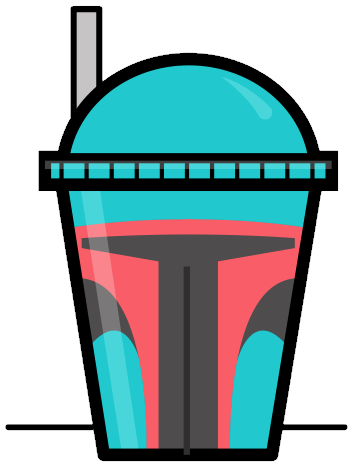

# Fett

(logo by the very talented [@adamgf](https://twitter.com/adamgf))

## Design Doc

This bot will manage its state in Redux, and use simple JSON file on disk for
persistance.

The redux store will be wrapped by a presentation layer that allows it to
interact with humans in slack.

This basic architecture is similar to the codenames slack bot at [codenames-redux slack bot](https://github.com/justjake/codenames-redux).

### reducers

- usersReducer - tracks mapping of slack ID (something like 'U1234ABCD') to a
  User object. We might want to store some user metadata here. Maybe track
  stats like shards lead, total boba requested, etc etc?
- channelsReducer - tracks mapping of a slack ID (something like 'C123ABCD') to
  a ChannelState object.
  - handles enabling and disabling the bot in the channel
  - unwraps channel specific actions, and dispatches them to the
  - enableChannel(channelId :: String) enable the bot in the given channel
  - disableChannel(channelId :: String) disable the bot in the given channel
  Actually, does it even make sense to have per-channel order? Maybe we just
  want one global order to start out with, usable from any channel that @fett
  is in.
- channelLobbyReducer - handles all single-channel-specific events. It's an
  option: Some<Order>, or None (channel is idle)
- orderReducer - main logic goes here. An order contains one or more Shards,
  and the overall state of an order is inferred from its shards.
  Actions:
  - makeRequest(req :: String, user :: User): insert a new request into this
    order for a user. Does nothing if the user already has a request in some
    shard.
  - cancelRequest(user :: User): cancel a user's request, removing it from the
    order.
  - balanceShardsWithMaxSize(size :: Int): rebalance the order's unlocked
    shards into new shards with a given max size.
  - electShardLeader(user :: User): make the given user the leader of their shard
  - shardLock(shardId :: String): lock a shard. It will not be modified
    by re-balancing, orders cannot be added or removed from it. Prepares the
    shard for the shard leader to make a Postmates order or whatever.
  - shardOrder(shardId :: String, url :: String?): set a shard's state to "ordered".
    optionally provides a URL of some sort; maybe a receipt link?
  - shardDeliver(shardId :: Strintg): set a shard's state to "delivered"
